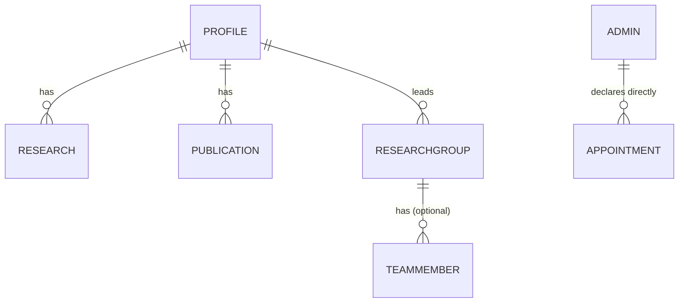
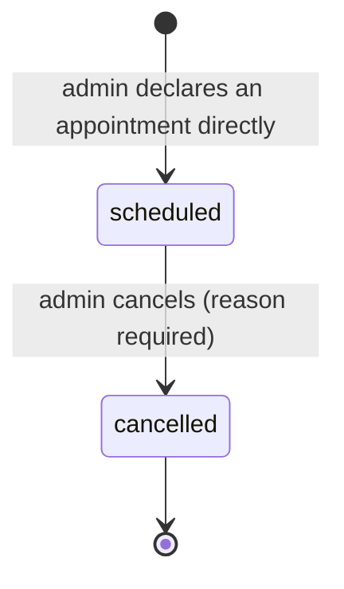

# Database

> **Source of truth for the schema:** `prisma/schema.prisma`. This page is a navigable summary —
> if the two disagree, the schema file wins.

## Engine & connection

- **Postgres**, hosted on **Supabase**. See [ADR-001](../decisions/ADR-001-database.md).
- **Prisma 7** — Rust-free client, connection URL lives in `prisma.config.ts` (not
  `schema.prisma`), `PrismaClient` instantiated with a driver adapter
  (`@prisma/adapter-pg` over a plain `pg` `Pool`) in `src/modules/shared/lib/prisma.ts`, **not**
  `@prisma/adapter-neon`.
- App uses the **pooled** `DATABASE_URL` (port 6543, pgbouncer); migrations use the **direct**
  `DIRECT_URL`. `npm run predev` runs `prisma migrate deploy` before `next dev`.
- **Prisma is imported only in repository files** (`src/modules/*/*.repository.ts`) — a hard rule,
  never relaxed for convenience.

## Models

| Model | Purpose | Notes |
|---|---|---|
| `Profile` | Singleton professor bio | Structured fields are `Json` (list-shaped, admin-edited as a whole): `education`, `fellowshipsVisiting`, `teachingRoles`, `teachingAwards`, `scholarshipsTravelAwards`, `researchInterests`, `invitedTalks`. Plus `linkedinUrl`/`googleScholarUrl` (nullable). |
| `Research` | Research works | `link` nullable. |
| `Publication` | Publications | `link` nullable (conference/book-chapter entries often have no stable URL). |
| `ResearchGroup` | Research groups | Has-many `TeamMember`. `members` JSON blob was **removed** — replaced by the relational entity below. |
| `TeamMember` | Researchers & visiting professors | `researchGroupId` nullable FK (`onDelete: SetNull`) — a member may be unaffiliated. |
| `Appointment` | Admin-declared appointments | See below — deliberately minimal after the 2026-08-08 rewrite. |
| `Setting` | Key/value flags | Currently only `upcoming_events_visible`. |
| `User`/`Session`/`Account`/`Verification` | Better Auth's own tables | Owned by Better Auth's Prisma adapter — **never query these from domain code**; only `src/modules/auth/auth.ts` hands the client to the adapter. |
| `AuditLog` | Append-only audit trail | Written by repositories, not services — see [architecture/backend.md](backend.md#audit-logging). |

### `Appointment` — current shape

```prisma
enum AppointmentStatus { scheduled cancelled }

model Appointment {
  id             String            @id @default(cuid())
  requesterName  String
  requesterEmail String?           // informational only — no email is ever sent for this
  researchGroup  String?
  scheduledAt    DateTime
  topic          String?
  status         AppointmentStatus @default(scheduled)
  cancelReason   String?
  createdAt      DateTime
  updatedAt      DateTime
}
```

**Fields that do not exist** (removed 2026-08-08, do not resurrect without a new ADR):
`source`, `pending`/`approved`/`booked` status values, `calendlyEventRef` /
`calendlyEventUri`/`calendlyInviteeUri`/`calendlyEventTypeUri`/`meetingUrl`/`cancelledAt`,
`requestedTime` (renamed `scheduledAt`, now admin-set exactly), `cancelToken` (no visitor
self-cancel flow exists). See [ADR-004](../decisions/ADR-004-appointment-workflow-admin-only.md).

## Conventions

- Models: `PascalCase` singular. Fields: `camelCase`, mapped to `snake_case` columns via
  `@map`/`@@map`.
- IDs: `String @id @default(cuid())`.
- Every domain entity has `createdAt`/`updatedAt` (`@default(now())` / `@updatedAt`).
- Domain code never sees Prisma's generated types directly outside repositories — repositories
  map rows to plain domain types (e.g. `toDomain()` in `appointment.repository.ts`).

## Relationships



No `Setting` governs appointment creation — `Setting` today only gates public Upcoming Events
visibility.

## Appointment status transitions



`cancelled` is terminal but **retained** — no row is ever hard-deleted. Any other transition
attempt (including cancelling an already-cancelled row) → `ConflictError` → `409`.

## Migration strategy

- Dev: `npm run db:migrate` (`prisma migrate dev`). **Never** run `migrate dev` against
  production — CI/CD runs `npm run db:deploy` (`prisma migrate deploy`).
- Migration history (`prisma/migrations/`) is itself a readable record of the schema's evolution —
  e.g. `20260807143226_simplify_appointments_admin_only`,
  `20260808044253_appointment_embed_only_no_calendly_sync` document the 2026-08-08 rewrite at the
  SQL level.
- `prisma/seed.ts` provisions the single admin from `ADMIN_EMAIL`/`ADMIN_INITIAL_PASSWORD`;
  `prisma/seed-demo.ts` adds demo content for local dev. Guard seed scripts so they never run
  destructively in production.
